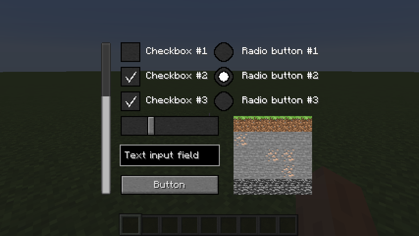
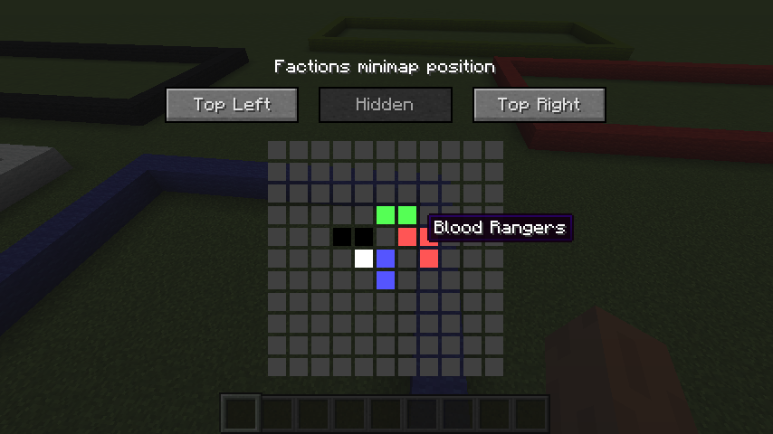
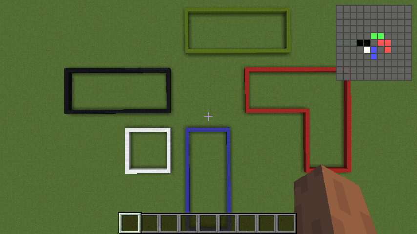

# Iodine

A Minecraft mod - server plugin pair that adds custom GUIs and overlays.
No more inventory and chat menus!
This is a successor to [NickAc's Lithium project](https://www.spigotmc.org/threads/lithium.274569/).

This project is under heavy development currently.
It is not in a usable state, everything is expected to change, etc.
Helping hands are welcome.

Currently a Forge based client-side and a Bukkit based server-side is being worked on.
Adding Fabric or especially Sponge support shouldn't be much trouble at all thanks
to how the project is structured: Forge and Bukkit are abstracted away.

What this project offers:

 - GUIs that can be viewed and interacted with by multiple players simultaneously
 - Clickable buttons, sliders, checkboxes, linear and grid layouts, etc.
 - Overlays which can be made into minimaps or custom status bars
 - An easy-to-use API for plugin developers to harness this all
 - Security: no remote code execution is done, the bandwidth is minimized as well
 - All this while keeping the Minecraftian feeling!

## Showcase

Showcase of some of the implemented elements:



Showcase of a proof-of-concept Factions minimap:





## API

Very simple, "Hello World" sample code:

```java
IodineApi.get().createGui()
    .addElement(GuiElements.TEXT, e -> e.setText("Hello, world!").setWidth(75))
    .addElement(GuiElements.BUTTON, 0, 15, e -> e.setText("Exit").setWidth(75)
        .onClicked((ee, p) -> p.closeOpenGui()))
    .onClosed((gui, p, byPlayer) -> p.sendMessage(
        byPlayer ? "You pressed the escape key" : "You clicked the exit button"))
    .openFor(IodineApi.get().getPlayer(player.getUniqueId()));
```

Real example code can be found in the [showcase](showcase/src/main/java/hu/trigary/iodine/showcase) subproject.

TODO add Maven, Gradle coordinates and link to JavaDocs (through JitPack, if possible)

## Modules

This project consists of multiple subprojects, each with their own role:

 - **common:** contains code that both *api* and *backend* require
 - **api:** the API that plugin developers use, included in *server*
 - **backend:** contains code that both *server* and *client* require
 - **server:** contains code that is used by multiple server-side plugin projects
 - **client:** contains code that is used by multiple client-side mod projects
 - **bukkit:** the Bukkit plugin part of the project
 - **forge-VERSION:** the Forge mod part of the project, for the specified version
 - **showcase** contains sample code, this is an actual Bukkit plugin

The *forge-VERSION* projects are not be real subprojects due to
ForgeGradle issues, they are actually considered separate projects by Gradle.
The *showcase* project isn't a subproject either since it's not an actual
component in neither the server-side, nor the client-side part of this project.

To recap which projects depend on which:

 - **api:** common
 - **backend:** common
 - **server:** backend + api (inherited: common)
 - **client:** backend (inherited: common)
 - **bukkit:** server (inherited: api, backend, common)
 - **forge-VERSION:** client (inherited: backend, common)
 - **showcase**: api (inherited: common)
